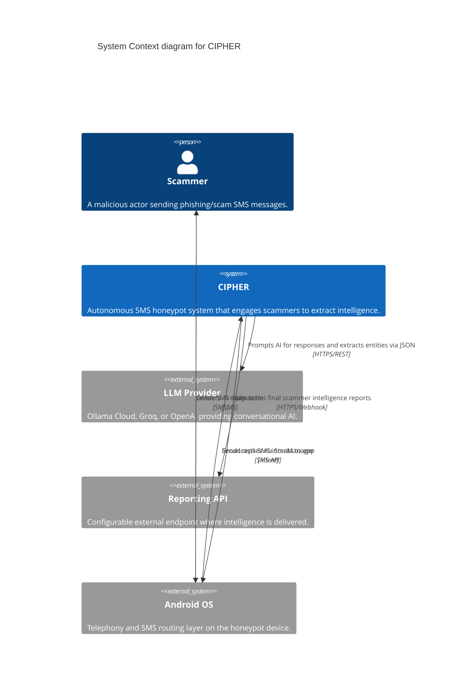
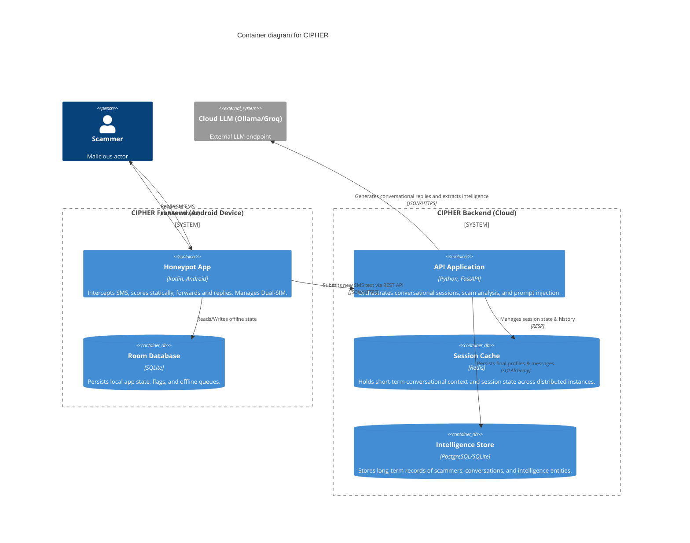
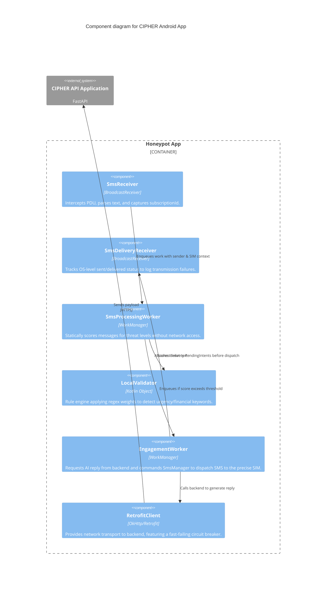
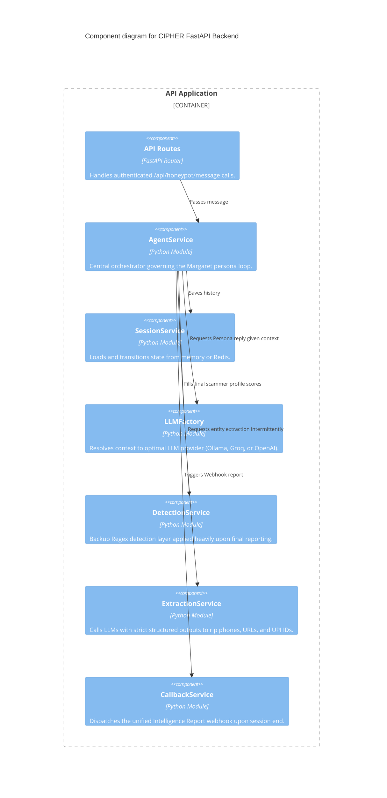

# CIPHER Platform Architecture

CIPHER (Conversational Intelligence Platform for Honeypot Engagement & Reporting) is a decentralized honeypot system for intercepting, engaging, and analyzing SMS scams in real-time.

It consists of two main layers:
1. **Frontend**: An autonomous Android application acting as the honeypot node.
2. **Backend**: A scalable FastAPI Python service that leverages LLMs to simulate a gullible target, analyze conversation context, and extract actionable threat intelligence.

## C4 Architecture Diagrams

### 1. Context Diagram

### 2. Container Diagram

### 3. Component Diagram (Android Frontend)

### 4. Component Diagram (Python Backend)

## Security & Privacy Considerations

1. **Local-First Triage**: The Android frontend uses `LocalValidator` to triage incoming messages textually. Regular, non-scam SMS messages are dropped locally and **never** travel to the cloud API.
2. **Circuit Breaking**: The `RetrofitClient` avoids bombarding the LLM backend during provider outages. If the LLM goes down, the Android app safely idles instead of spinning up back-to-back threads.
3. **Multi-SIM Affinity**: Replies are firmly pinned to the exact `subscriptionId` routing the inbound intent. The AI won't mistakenly reply to a scam from your personal secondary SIM using your primary work SIM.
4. **Authentication**: Device-to-Cloud communication strictly employs `x-api-key`. 
5. **No Telemetry**: No third-party analytics are embedded in the APK.

## Future Milestones
- Next.js Web Dashboard for Visualizing active sessions and the extracted intelligence database.
- Enhanced context-compression for ultra-long scambaiting threads spanning > 20 turns.
- Webhook auto-retry capabilities for the `CallbackService`.
