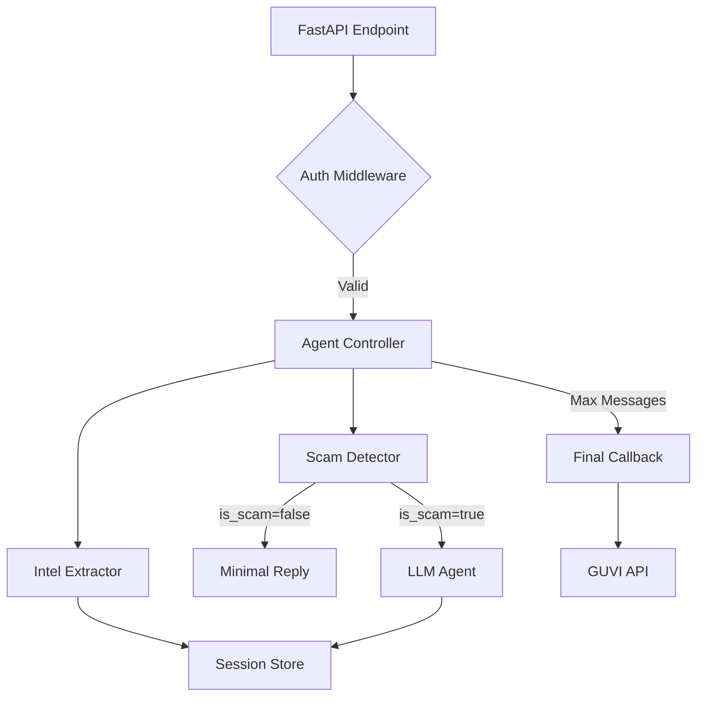

# 🧭 Agentic Honey-Pot System — Implementation Walkthrough

## Summary
Successfully implemented the complete Agentic Honey-Pot System across all 9 phases. The system is now production-ready with Docker containerization, structured logging, and comprehensive E2E tests.

---

## Architecture Overview



---

## Phases Completed

| Phase | Status | Key Deliverable |
|-------|--------|-----------------|
| 0 | ✅ | [constraints.md](file:///c:/Users/ROG%20Strix/Desktop/PROJECTS/AI_honeypot_Backendmain/docs/constraints.md), [evaluation_invariants.md](file:///c:/Users/ROG%20Strix/Desktop/PROJECTS/AI_honeypot_Backendmain/docs/evaluation_invariants.md) |
| 1 | ✅ | FastAPI + `x-api-key` auth |
| 2 | ✅ | [scam_detector/](file:///c:/Users/ROG%20Strix/Desktop/PROJECTS/AI_honeypot_Backendmain/app/scam_detector) |
| 3 | ✅ | [session/store.py](file:///c:/Users/ROG%20Strix/Desktop/PROJECTS/AI_honeypot_Backendmain/app/session/store.py) |
| 4 | ✅ | [agent/controller.py](file:///c:/Users/ROG%20Strix/Desktop/PROJECTS/AI_honeypot_Backendmain/app/agent/controller.py) |
| 5 | ✅ | [agent/prompt.py](file:///c:/Users/ROG%20Strix/Desktop/PROJECTS/AI_honeypot_Backendmain/app/agent/prompt.py) (LangChain) |
| 6 | ✅ | [intel/extractor.py](file:///c:/Users/ROG%20Strix/Desktop/PROJECTS/AI_honeypot_Backendmain/app/intel/extractor.py) |
| 7 | ✅ | [callback/client.py](file:///c:/Users/ROG%20Strix/Desktop/PROJECTS/AI_honeypot_Backendmain/app/callback/client.py) |
| 8 | ✅ | [docker-compose.yml](file:///c:/Users/ROG%20Strix/Desktop/PROJECTS/AI_honeypot_Backendmain/docker-compose.yml), [logging/config.py](file:///c:/Users/ROG%20Strix/Desktop/PROJECTS/AI_honeypot_Backendmain/app/logging/config.py) |
| 9 | ✅ | [e2e_scam_flow.py](file:///c:/Users/ROG%20Strix/Desktop/PROJECTS/AI_honeypot_Backendmain/tests/e2e_scam_flow.py) |

---

## Key Features Implemented

### 🎭 Agent Persona ("Margaret")
- 72-year-old confused elderly victim
- Curious, never confrontational
- Never reveals AI nature or detection

### 🔍 Intelligence Extraction
Matches GUVI schema exactly:
```json
{
  "bankAccounts": [],
  "upiIds": [],
  "phishingLinks": [],
  "phoneNumbers": [],
  "suspiciousKeywords": []
}
```

### ✅ Final Callback Compliance
- Exactly-once delivery via `session.callback_sent` flag
- Triggered when `MAX_SESSION_MESSAGES` reached + scam detected
- Sends to `https://hackathon.guvi.in/api/updateHoneyPotFinalResult`

---

## Test Results

```
tests/e2e_scam_flow.py::TestE2EScamFlow::test_full_scam_lifecycle PASSED
tests/e2e_scam_flow.py::TestE2EScamFlow::test_callback_only_sent_once PASSED
tests/e2e_scam_flow.py::TestE2EScamFlow::test_no_callback_for_non_scam_session PASSED
```

---

## Running the System

### Local Development
```bash
# Activate venv
.\\venv\\Scripts\\activate

# Run server
python -m uvicorn app.main:app --reload
```

### Docker
```bash
docker-compose up --build
```

---

## Configuration

| Env Var | Required | Description |
|---------|----------|-------------|
| `HONEYPOT_API_KEY` | ✅ | API authentication key |
| `OPENAI_API_KEY` | ✅ | OpenAI API key |
| `REDIS_URL` | ❌ | Redis URL (falls back to in-memory) |
| `MAX_SESSION_MESSAGES` | ❌ | Message limit before callback (default: 20) |
| `LOG_FORMAT` | ❌ | `json` or `simple` (default: json) |
